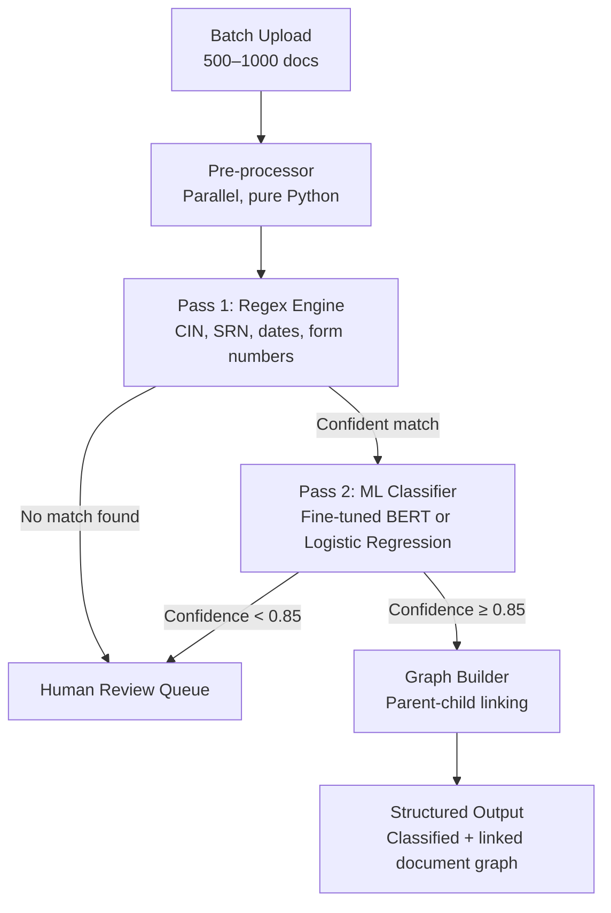
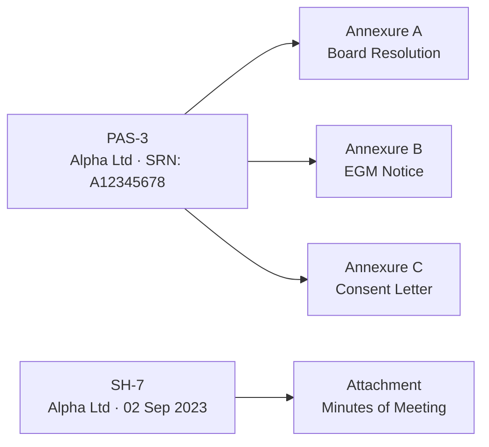
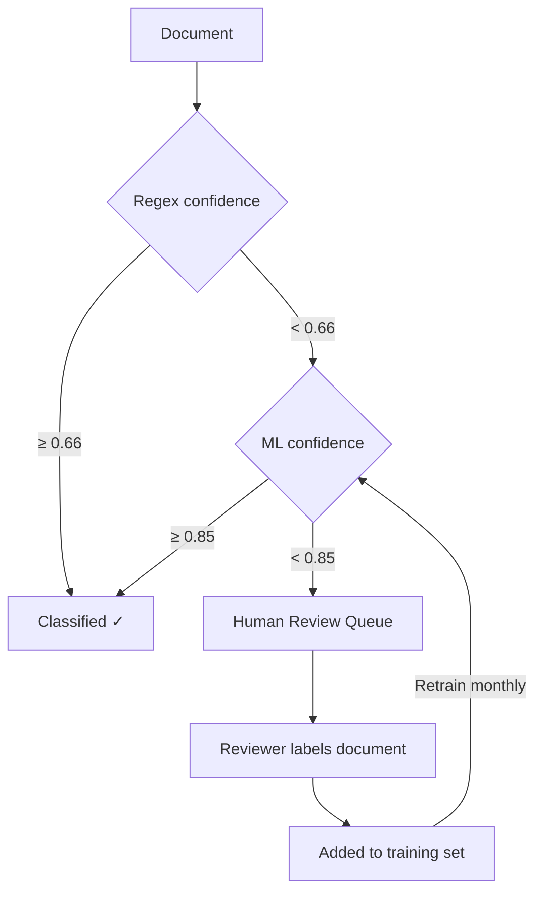
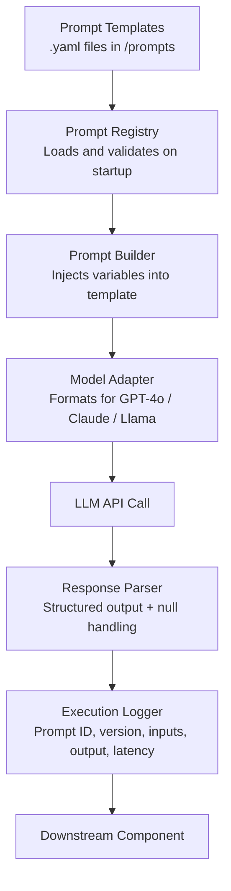
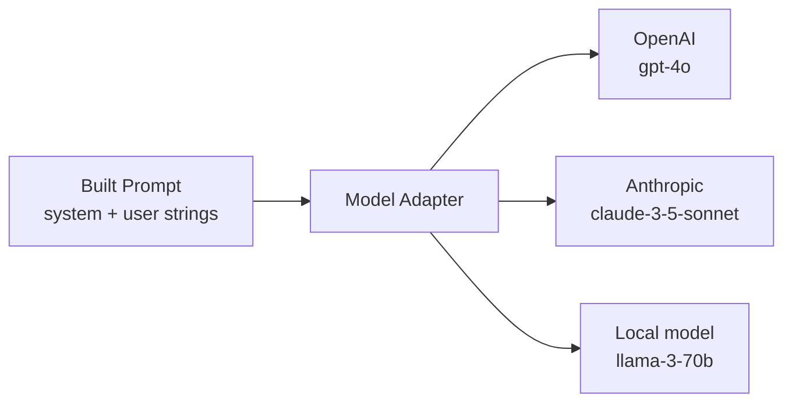

# Task-2
# Problem 1
# Document Classification System — Design Document

## Problem Statement

We receive batches of 500–1000 compliance documents at a time — SH-7, PAS-3, PAS-5, Board Resolutions, EGM Notices, and their attachments. These documents are not random. They have structure, fixed formats, and parent-child relationships. The system needs to classify every document by type and correctly link attachments to their parent filings — reliably, at speed, without relying on an LLM.

---

## Core Design Philosophy

**Deterministic first, AI second.**

Since all these document types (SH-7, PAS-3, PAS-5, etc.) follow fixed MCA-prescribed formats, we don't need a general-purpose model. We exploit the structure of the documents rather than trying to understand them from scratch. The AI only steps in where the rules fall short.

Three principles guide every decision:

- **Extract don't generate** — the system reads and matches, it never infers or guesses
- **Confidence-gated routing** — documents only move to the next stage if the previous stage was confident enough; uncertain ones are flagged for humans
- **No silent failures** — every unclassified or low-confidence document is visible and actionable, not silently dropped

---

## System Overview



---

## Stage 1 — Pre-processor (No AI, Runs in Parallel)

Before any classification happens, a pure Python pre-processor runs across all documents simultaneously. Its job is to extract cheap, deterministic signals that every subsequent stage depends on.

**What it extracts:**

- **Filename hints** — prefixes like `SH7_`, `PAS3_`, `Annexure_` are strong signals even before reading the file
- **Filing date** — parsed from filename or first page header
- **Company CIN** — a 21-character alphanumeric identifier that appears in virtually every MCA form
- **SHA-256 hash** — catches duplicate uploads before they waste classifier capacity
- **Text slice** — first 800 words only, which captures the form header and declaration block where all classification-relevant information lives

```python
import re
import hashlib

CIN_PATTERN = re.compile(r'\b[UL]\d{5}[A-Z]{2}\d{4}[A-Z]{3}\d{6}\b')
DATE_PATTERN = re.compile(r'\b(\d{1,2})[\/\-](\d{1,2})[\/\-](\d{2,4})\b')
SRN_PATTERN  = re.compile(r'\bSRN[:\s]*([A-Z]\d{8})\b', re.IGNORECASE)

def extract_signals(text: str, filename: str) -> dict:
    text_slice = " ".join(text.split()[:800])
    return {
        "cin":      CIN_PATTERN.search(text_slice),
        "date":     DATE_PATTERN.search(text_slice),
        "srn":      SRN_PATTERN.search(text_slice),
        "filename": filename,
        "hash":     hashlib.sha256(text.encode()).hexdigest(),
        "slice":    text_slice,
    }
```

This stage runs with `asyncio` across all documents simultaneously. At 1000 documents, it completes in under 5 seconds.

---

## Stage 2 — Pass 1: Regex Classification Engine

The regex engine is the first classification gate. Because MCA forms have legally mandated headers and declaration text, a well-built pattern library can classify the majority of documents with high certainty and zero model cost.

**How it works:**

Each document type has a set of must-match patterns. A document is classified only if it hits a minimum number of them — this prevents partial matches from causing false positives.

```python
FORM_SIGNATURES = {
    "SH-7": [
        re.compile(r'Form\s*No[\.\s]*SH-?7', re.IGNORECASE),
        re.compile(r'Alteration of Share Capital', re.IGNORECASE),
        re.compile(r'authorised\s+capital', re.IGNORECASE),
    ],
    "PAS-3": [
        re.compile(r'Form\s*No[\.\s]*PAS-?3', re.IGNORECASE),
        re.compile(r'Return of Allotment', re.IGNORECASE),
    ],
    "PAS-5": [
        re.compile(r'Form\s*No[\.\s]*PAS-?5', re.IGNORECASE),
        re.compile(r'private placement offer', re.IGNORECASE),
    ],
}

def regex_classify(text_slice: str) -> tuple[str | None, float]:
    scores = {}
    for form_type, patterns in FORM_SIGNATURES.items():
        hits = sum(1 for p in patterns if p.search(text_slice))
        scores[form_type] = hits / len(patterns)

    best = max(scores, key=scores.get)
    return (best, scores[best]) if scores[best] >= 0.66 else (None, 0.0)
```

A document needs to match at least 2 out of 3 patterns to be classified at this stage. Documents that don't hit the threshold are passed directly to the ML classifier rather than guessed at.

**Expected coverage:** ~70–75% of documents classified here, with near-zero false positives.

---

## Stage 3 — Pass 2: ML Classifier

Documents that the regex engine couldn't confidently classify go to the ML classifier. This handles edge cases: older form versions, scanned PDFs with OCR noise, or documents where the header is partially missing.

### Model Choice

Two options, and the right choice depends on dataset size:

| Scenario | Recommended Model |
|---|---|
| < 500 labeled examples | Logistic Regression on TF-IDF features |
| 500+ labeled examples | Fine-tuned BERT (e.g. `legal-bert-base-uncased`) |

For most compliance teams that have been filing for years, 500+ labeled examples will already exist in historical records. Fine-tuned BERT is the long-term recommendation.

### Why BERT works well here

These documents have a fixed structure — the form type, company details, and purpose all appear in the first section every time. BERT's attention mechanism naturally learns to focus on the header block and declaration text where the classification signal is concentrated. Because the vocabulary is domain-specific (MCA forms use consistent legal phrasing), even a small fine-tuning dataset of 300–500 examples per class gets you to 92–95% accuracy.

```python
from transformers import pipeline

classifier = pipeline(
    "text-classification",
    model="./fine-tuned-mca-bert",  # your fine-tuned checkpoint
    tokenizer="legal-bert-base-uncased",
    truncation=True,
    max_length=256   # covers first ~800 words, more than enough
)

def ml_classify(text_slice: str) -> tuple[str, float]:
    result = classifier(text_slice)[0]
    return result["label"], result["score"]
```

**Confidence threshold:** Only accept the ML result if confidence ≥ 0.85. Below that, route to human review.

### Fallback: Logistic Regression

If labeled data is limited, TF-IDF + Logistic Regression is faster to train and still hits 85–90% accuracy on fixed-format legal documents.

```python
from sklearn.pipeline import Pipeline
from sklearn.linear_model import LogisticRegression
from sklearn.feature_extraction.text import TfidfVectorizer

model = Pipeline([
    ("tfidf", TfidfVectorizer(ngram_range=(1, 2), max_features=10000)),
    ("clf",   LogisticRegression(max_iter=1000, C=1.0))
])

model.fit(train_texts, train_labels)
```

---

## Stage 4 — Parent-Child Linking (Graph Builder)

Once all documents are classified, the graph builder runs across the full batch to link attachments to their parent filings. This is a deterministic matching problem — no AI involved.



**Linking signals, in priority order:**

1. **SRN match** — explicit cross-reference in the document text (weight: 0.6)
2. **CIN match** — same company identifier across documents (weight: 0.2)
3. **Date proximity** — filed within 7 days of each other (weight: 0.1)
4. **Filename keyword** — contains "annexure", "attachment", "enclosure" (weight: 0.1)

A link is created when the combined score reaches ≥ 0.7.

```python
def compute_link_score(candidate: dict, parent: dict) -> float:
    score = 0.0
    if candidate.get("srn_ref") == parent.get("srn"):
        score += 0.6
    if candidate.get("cin") == parent.get("cin"):
        score += 0.2
    delta = abs((candidate["date"] - parent["date"]).days)
    if delta <= 7:
        score += 0.1
    if any(kw in candidate["filename"].lower() for kw in
           ["annexure", "attachment", "enclosure", "exhibit", "schedule"]):
        score += 0.1
    return score
```

---

## Confidence Routing & Human Review

Every document has a confidence score at the end of classification. Routing decisions are fully transparent.



Human reviewers don't just fix the current batch — every document they label gets added to the training set, so the model continuously improves. In practice, the human review queue should shrink with each monthly retraining cycle.

---

## Performance at Scale

| Stage | 1000 docs — estimated time |
|---|---|
| Pre-processor (async, parallel) | ~3–5 seconds |
| Regex engine | ~2–4 seconds |
| ML classifier (BERT, GPU) | ~25–40 seconds |
| ML classifier (Logistic Regression, CPU) | ~3–5 seconds |
| Graph builder (linking) | ~2–3 seconds |
| **Total** | **~35–55 seconds (BERT) / ~10–17 seconds (LR)** |

---

## Key Design Decisions Summary

| Decision | Rationale |
|---|---|
| Regex before ML | Eliminates 70%+ of documents at near-zero cost; no model needed for standard filings |
| Text slice (first 800 words only) | All classification-relevant information lives in the header; rest is boilerplate |
| Confidence thresholds | Prevents silent misclassification; uncertain documents are surfaced, not hidden |
| Graph-based linking | Relationship inference runs on the full batch, not per-document — the only reliable approach |
| Human review feeds retraining | Shrinks the uncertain pool over time; the system gets better without code changes |
| SHA-256 deduplication | Catches duplicate uploads before they enter the classification pipeline |

# Problem 2

# Prompt Architecture Design — Production AI Systems

## Problem Statement

When a system has 100+ prompts spread across extraction pipelines, reasoning agents, classifiers, and financial analysis workflows, ad-hoc prompt writing stops working fast. A small wording change breaks a downstream component. Nobody knows which version of a prompt is running in production. Switching models means rewriting prompts by hand. Debugging a bad output means digging through raw strings with no context.

The goal is to treat prompts the way good engineering teams treat code - versioned, tested, modular, and observable.

---

## Core Idea

**Prompts are code. Treat them like it.**

Every principle that makes software maintainable applies directly to prompts:

- Each prompt does one thing
- Instructions, data, and formatting are kept separate
- Every change is tracked and reversible
- Outputs can be tested against expected behavior
- Every execution is logged and traceable

---

## System Overview



---

## Layer 1 - Prompt Templates (The Source of Truth)

Every prompt lives as a `.yaml` file inside a `/prompts` folder that is committed to version control. No prompt string is ever written directly inside application code.

A prompt file contains everything needed to understand, run, and audit it — the instructions, the variables it expects, the output it should return, and a history of every change made to it.

```yaml
# prompts/extraction/sh7_extractor.yaml

id: sh7_extractor
version: "2.1.0"
description: "Extracts authorised capital change fields from a confirmed SH-7 filing."
owner: extraction-team

input_variables:
  - name: document_text
    required: true
    description: "Raw text of the SH-7 document"
  - name: company_name
    required: false
    description: "Company name for cross-validation, if known"

system_prompt: |
  You are a compliance data extraction assistant. Your only job is to read
  MCA Form SH-7 filings and return structured JSON. You never guess.
  If a field is unclear or missing, return null for that field.

user_prompt: |
  Extract the following fields from this document.

  Document:
  {{ document_text }}

  
  Expected company: {{ company_name }}. Flag a mismatch if the document
  refers to a different entity.
  

  Return ONLY valid JSON. No explanation.

output_schema:
  from_amount:    number or null
  to_amount:      number or null
  face_value:     number or null
  date_of_change: date string or null
  gm_type:        AGM / EGM / null
  mismatch_flag:  boolean

changelog:
  - version: "2.1.0"
    date: "2024-11-03"
    author: "riya.sharma"
    change: "Added mismatch_flag for company name cross-validation"
  - version: "2.0.0"
    date: "2024-09-15"
    author: "aman.kapoor"
    change: "Migrated to structured output schema"
  - version: "1.0.0"
    date: "2024-07-01"
    author: "aman.kapoor"
    change: "Initial version"
```

**Why YAML?** Because it handles multiline text cleanly, it's human-readable, and it lives in Git. Every change has an author, a timestamp, and a diff. No special tooling needed.

---

## Layer 2 - Prompt Registry

The registry loads all prompt files when the application starts, checks that each file has everything it needs, and makes prompts available to the rest of the codebase by ID.

**What "validates" means here:** before the app starts serving requests, the registry reads every prompt file and checks for required fields — version, input variables, output schema, and so on. If a file is missing something, the app throws an error immediately at startup rather than failing silently at runtime when that prompt is actually called.

```python
class PromptRegistry:
    def __init__(self, prompts_dir="./prompts"):
        self._prompts = {}
        self._load_all(prompts_dir)

    def _load_all(self, directory):
        for path in Path(directory).rglob("*.yaml"):
            with open(path) as f:
                prompt = yaml.safe_load(f)
            self._validate(prompt)
            self._prompts[prompt["id"]] = prompt

    def get(self, prompt_id: str) -> dict:
        if prompt_id not in self._prompts:
            raise KeyError(f"Prompt '{prompt_id}' not found.")
        return self._prompts[prompt_id]

    def _validate(self, prompt: dict):
        required = ["id", "version", "system_prompt",
                    "user_prompt", "input_variables", "output_schema"]
        for key in required:
            if key not in prompt:
                raise ValueError(
                    f"Prompt '{prompt.get('id', 'unknown')}' is missing: {key}"
                )
```

The rest of the codebase never reads `.yaml` files directly — it just calls `registry.get("sh7_extractor")`.

---

## Layer 3 - Prompt Builder (Variable Injection)

The builder takes a prompt template and the runtime values it needs, checks that all required variables are present, and produces the final prompt text by slotting the values into the template.

The `{{ document_text }}` placeholders in the YAML file are replaced with actual content at this stage. The builder also supports simple conditional blocks — for example, only including a cross-validation instruction when a company name was provided.

```python
class PromptBuilder:
    def build(self, prompt_id: str, variables: dict) -> dict:
        template = registry.get(prompt_id)
        self._check_required_inputs(template, variables)

        system = render_template(template["system_prompt"], variables)
        user   = render_template(template["user_prompt"], variables)

        return {
            "prompt_id": prompt_id,
            "version":   template["version"],
            "system":    system,
            "user":      user,
            "schema":    template["output_schema"],
        }

    def _check_required_inputs(self, template, variables):
        for var in template["input_variables"]:
            if var["required"] and var["name"] not in variables:
                raise ValueError(
                    f"Missing required variable '{var['name']}' "
                    f"for prompt '{template['id']}'"
                )
```

---

## Layer 4 - Model Adapter (Model Agnosticism)

Different LLMs expect different API formats. OpenAI uses a `messages` array with roles. Anthropic has a separate `system` parameter. Local models like Llama fold everything into a single message. The model adapter handles all of this in one place so the rest of the system never needs to know which model it's talking to.



```python
class ModelAdapter:
    def format(self, built_prompt: dict, model: str) -> dict:
        system = built_prompt["system"]
        user   = built_prompt["user"]

        if model.startswith("gpt-"):
            return {
                "model": model,
                "messages": [
                    {"role": "system", "content": system},
                    {"role": "user",   "content": user},
                ],
            }
        elif model.startswith("claude-"):
            return {
                "model":    model,
                "system":   system,
                "messages": [{"role": "user", "content": user}],
                "max_tokens": 1024,
            }
        elif model.startswith("llama"):
            return {
                "model": model,
                "messages": [
                    {"role": "user", "content": f"{system}\n\n{user}"},
                ],
            }
        else:
            raise ValueError(f"No adapter configured for model: {model}")
```

Switching the entire system from GPT-4o to Claude is a one-line config change. No prompt file is touched.

---

## Layer 5 - Execution Logger (Debuggability + Traceability)

Every prompt execution is logged before the API call is made and updated with the result once it returns. Each execution gets a unique trace ID.

This makes it possible to answer questions like:
- What exact prompt text was sent for this document?
- Which prompt version was live when this bug occurred?
- Which prompts are slowest or most expensive?
- Did output quality improve after updating from v2.0.0 to v2.1.0?

```python
class ExecutionLogger:
    def log_call(self, prompt_id, version, model, system, user, variables) -> str:
        trace_id = str(uuid.uuid4())
        self._write({
            "trace_id":  trace_id,
            "prompt_id": prompt_id,
            "version":   version,
            "model":     model,
            "timestamp": time.time(),
            "inputs":    variables,
            "system":    system,
            "user":      user,
            "status":    "pending",
        })
        return trace_id

    def log_result(self, trace_id, raw_output, parsed_output, latency_ms, error=None):
        self._update(trace_id, {
            "raw_output":    raw_output,
            "parsed_output": parsed_output,
            "latency_ms":    latency_ms,
            "status":        "error" if error else "success",
            "error":         error,
        })
```

When a bug is reported, the trace ID gives you everything needed to reproduce it exactly — the prompt version, the inputs, and the raw model output.

---

## Putting It All Together

This is what calling any prompt looks like from application code. No prompt strings, no model-specific logic, no manual formatting.

```python
result = prompt_runner.run(
    prompt_id = "sh7_extractor",
    variables = {
        "document_text": doc_text,
        "company_name":  "Alpha Ltd"
    },
    model = config.DEFAULT_MODEL,  # swap models in one place
)

# result always has the same shape regardless of model or prompt version
# { "data": {...}, "trace_id": "...", "prompt_id": "...", "version": "..." }
```

---

## Version Control Strategy

Because all prompt files live in Git, the team gets full version control for free — no additional tooling required.

```
prompts/
├── extraction/
│   ├── sh7_extractor.yaml
│   ├── pas3_extractor.yaml
│   └── pas5_extractor.yaml
├── classification/
│   └── form_classifier.yaml
├── summarization/
│   └── board_resolution_summary.yaml
└── financial_analysis/
    └── capital_structure_builder.yaml
```

Prompt changes go through pull requests just like code changes. A reviewer can see exactly which lines changed and approve or reject before it reaches production.

**Production runs pinned versions** — a merge does not automatically affect live behavior. A prompt version has to be explicitly promoted.

```yaml
# config/production.yaml
prompt_versions:
  sh7_extractor:   "2.1.0"   # pinned
  form_classifier: "3.0.0"   # pinned
  pas3_extractor:  "1.3.0"   # pinned
```

---

## Testing Prompts

Prompts should have regression tests the same way functions do. A test provides a fixed input and asserts that the output matches expected behavior. These tests run in CI before any prompt change is merged.

```python
def test_sh7_standard_extraction():
    result = prompt_runner.run(
        prompt_id = "sh7_extractor",
        variables = {"document_text": load_fixture("sh7_alpha_2023.txt")},
        model     = "gpt-4o",
    )
    assert result["data"]["from_amount"] == 5_000_000
    assert result["data"]["to_amount"]   == 10_000_000
    assert result["data"]["face_value"]  == 10

def test_sh7_returns_null_for_missing_fields():
    result = prompt_runner.run(
        prompt_id = "sh7_extractor",
        variables = {"document_text": load_fixture("sh7_partial_scan.txt")},
        model     = "gpt-4o",
    )
    # Partial document — must return nulls, never hallucinate
    assert result["data"]["face_value"] is None
```

---

## How Each Requirement Is Met

| Requirement | How it's solved |
|---|---|
| **Maintainability** | Prompts live in `.yaml` files; no prompt string ever appears in application code |
| **Model agnosticism** | The Model Adapter translates one built prompt into any model's API format |
| **Debuggability** | Every execution is logged with a trace ID, exact inputs, raw output, and latency |
| **Traceability** | `prompt_id` and `version` are attached to every API call and its result |
| **Version control** | Git-managed prompt files; PRs required for changes; pinned versions in production |
| **Testability** | Regression tests assert expected outputs and run in CI on every merge |